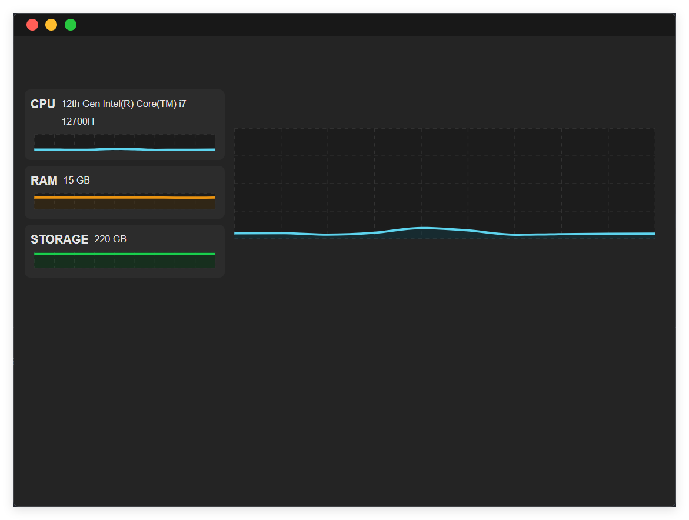
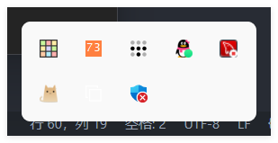

## System Monitoring Application

> 一个基于 Electron, React 和 TypeScript 的系统监控应用程序

> 它解决了设置一个显示 CPU、RAM 和文件系统系统资源使用情况的电子应用程序的问题
> - 具有类型安全的 IPC 通信, 高度封装集成, 简单的 IPC 通信挂载 Mapping 策略
> - 具有隐藏到托盘功能
> - 带有自定义菜单栏
> - 带有定制窗框 (仿 MacOS 交通灯)

> 它使用 E2E-`Playwright`和单元测试`Vitest`进行测试

## 项目启动
1. 安装依赖
```bash
pnpm i
```
2. 启动项目
```bash
pnpm dev

// 该命令将运行脚本 dev:react 和 dev:electron, 即启动渲染层后, 编译ts代码并启动electron进程, 支持热重载
```
3. 构建项目
```bash
pnpm dist:win
pnpm dist:mac
pnpm dist:linux

// 项目打包完后会在 dist 文件夹下生成对应的平台包, 提供启动可执行文件和安装包
```

## 项目展示


